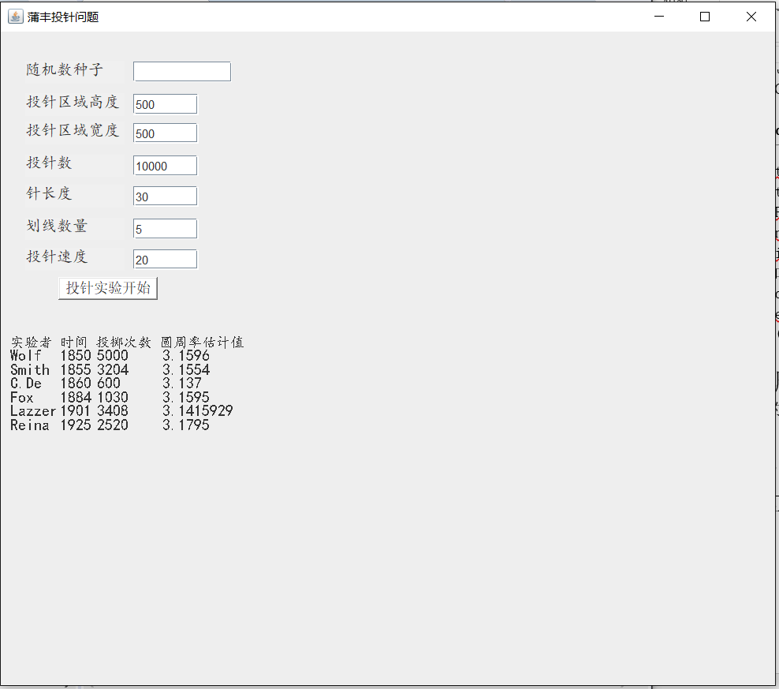
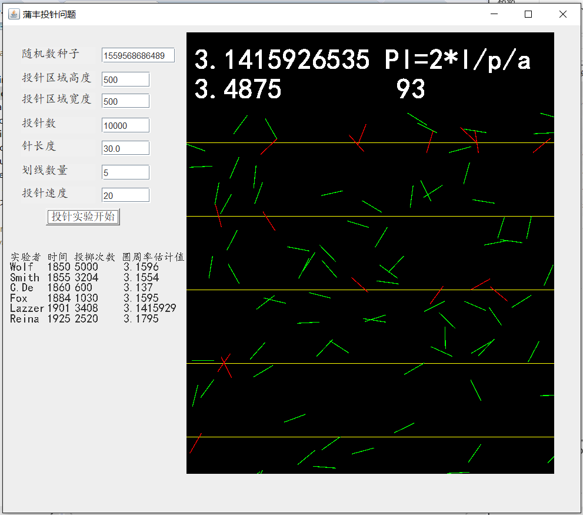
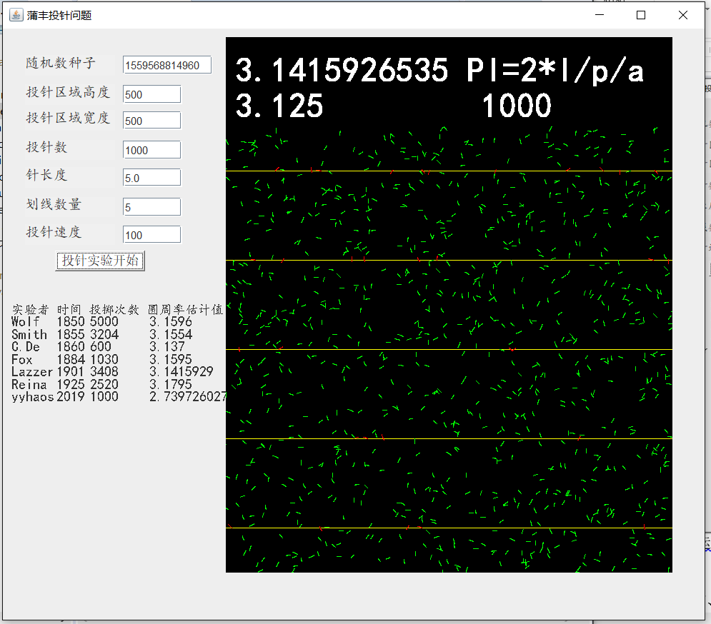
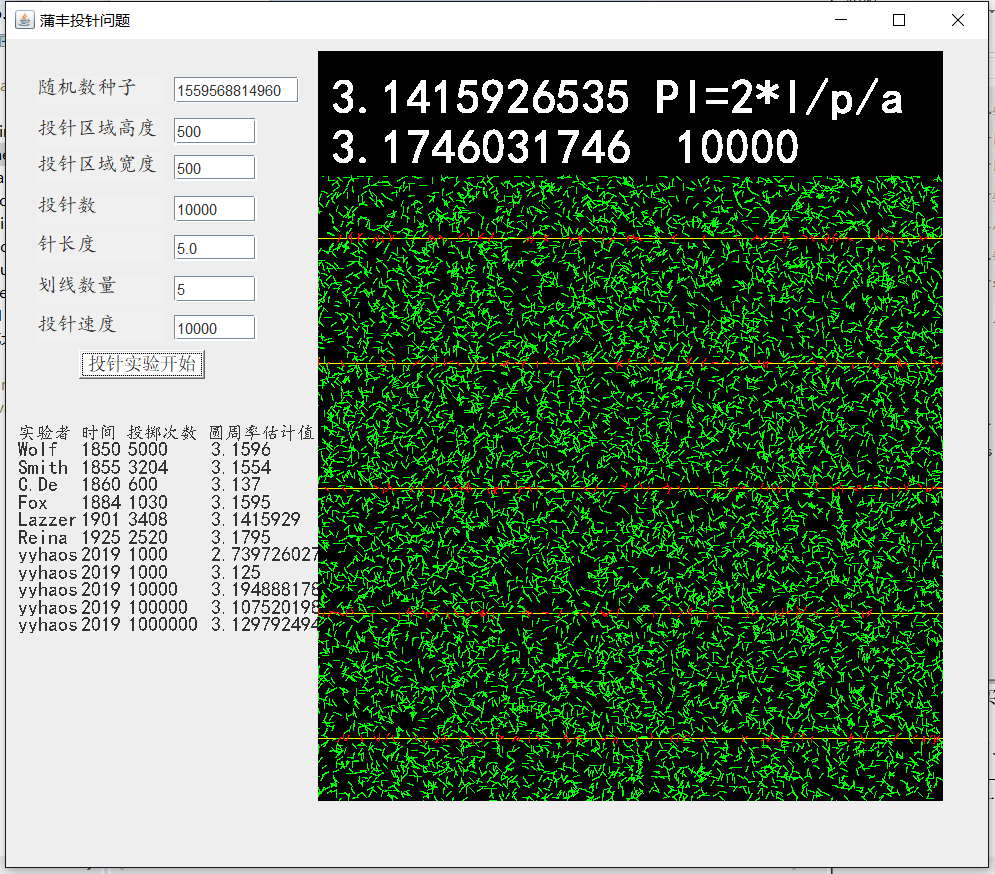
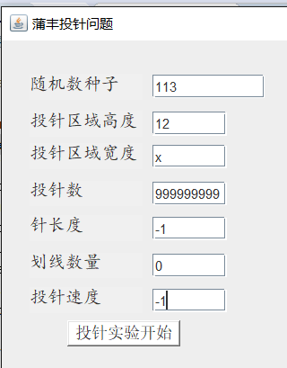
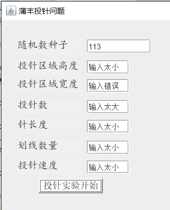
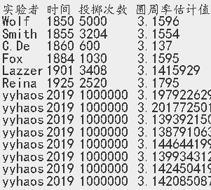

## 运行的界面初始化如图： 
  
## 单击button后的程序运行截图如图所示： 
  
## 单次运行完成后的截图： 
  
## 完成实验多次后的截图： 
  
## 测试检错机制的截图： 
  
  

##  测试结果
  
发现在随机数种子为12、高度为800、宽度为800、投针数为1000000（上限）、针长度为20、划线数量为20、投针速度为10000000时，能够得到一个比较接近PI的估计值。 
